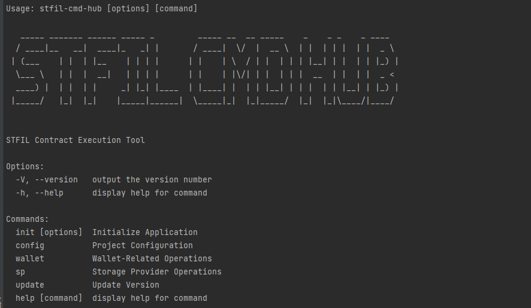

# Welcome to stfil-cli 👋

[](https://opensource.org/licenses/Apache-2.0)

> STFIL Contract Execution Tool

### 🏠 [Homepage](https://stfil.io)

## Install

```sh
git clone https://github.com/stfil-io/stfil-cli.git
cd stfil-cli
npm install
npm link
stfil -h
```

## Usage

```sh
npm i @stfil/stfil-cli -g
```
### Check for successful installation
```sh
stfil-cli -h
```



### Initialization environment
```sh
stfil-cli init
```

### There are 2 ways to save your wallet private key
1. Naked in the config.json file, even if the private key is simply encrypted, but not secure
2. Use the passphrase entered by the user to encrypt and save the private key, but then you need to enter an additional password every time you


### Add Wallet
```sh
stfil-cli wallet add
```
### Wallet List
```sh
stfil-cli wallet list
```
### Wallet details
```sh
stfil-cli wallet info
```

### Lending Pool add
```sh
stfil-cli splp add 0xc5A520f9Ea2DB52805f570741B1E869E07f308d4
```

### Lending Pool list
```sh
stfil-cli splp list
```

### Lending Pool info
```sh
stfil-cli splp info
```

### Node info
```sh
stfil-cli splp node info f041395
```

### Borrowing pool operation
Variable rate borrowing 10FIL
```sh
stfil-cli splp node sealLoan -r v -a 10 f041395 
```
Stable rate borrowing 10FIL
```sh
stfil-cli splp node sealLoan -r r -a 10 f041395 
```

### Timed automatic borrowing

Checks every minute if the available balance in the wallet is less than the specified value, if so borrows

Examples:
When the available balance is less than 100, borrow 100

```sh
stfil-cli splp node autoSealLoad -alt 100 -a 100 f041395
```

### Timed automatic repayment

Checks every minute if the available balance in the wallet is greater than the specified value, and if so, debits the
Examples:
Repayment of 100 when the available balance is greater than 100

```sh
stfil-cli splp node autoRepay -agt 100 -a 100 f041395
```


## Docker Install

```sh
git clone https://github.com/stfil-io/stfil-cli.git
cd stfil-cli
docker build -t stfil-cli .
docker run -it stfil-cli
```
When running with docker, you need to complete the initialization operations

When running with docker, you need to complete the initialization operation, and when the container is ready, exit the container command line using 
```sh
Ctrl + P followed by  Ctrl + Q
```
The container restart operation needs to be reparameterized, using the following command

```sh
docker start -i <CONTAINER ID>
```

Use this command to exit the container
```sh
Ctrl + P followed by  Ctrl + Q
```

## Author

👤 **STFIL <info@stfil.io>**

* Twitter: [@stfil\_io](https://twitter.com/stfil\_io)
