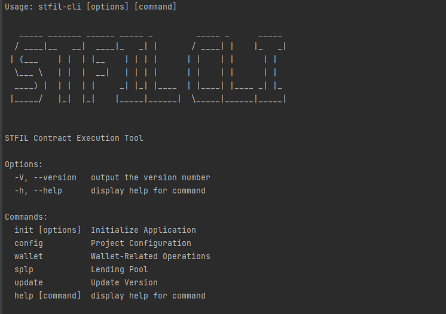

# Welcome to stfil-cli 👋

[](https://opensource.org/licenses/Apache-2.0)

> STFIL Contract Execution Tool

### 🏠 [Homepage](https://stfil.io)

## Install

```sh
git clone https://github.com/stfil-io/stfil-cli.git
cd stfil-cli
npm install
npm link
stfil -h
```

## Usage

```sh
npm i @stfil/stfil-cli -g
```
### Check for successful installation
```sh
stfil-cli -h
```



### Initialization environment
```sh
stfil-cli init
```

### There are 2 ways to save your wallet private key
1. Naked in the config.json file, even if the private key is simply encrypted, but not secure
2. Use the passphrase entered by the user to encrypt and save the private key, but then you need to enter an additional password every time you


### Wallet details
```sh
stfil-cli wallet info
```

### Node details
```sh
stfil-cli sp info f041385
```

### Storage provider loan
Variable rate borrowing 10FIL
```sh
stfil-cli sp sealLoan f041385 10
```
Stable rate borrowing 10FIL
```sh
stfil-cli sp sealLoan -r 1 f041385 10
```

### Pool details
```sh
stfil-cli sp pool info 0xc5A520f9Ea2DB52805f570741B1E869E07f308d4
```

### Borrowing pool operation
Variable rate borrowing 10FIL
```sh
stfil-cli sp pool sealLoan 0xc5A520f9Ea2DB52805f570741B1E869E07f308d4 f041395 10
```
Stable rate borrowing 10FIL
```sh
stfil-cli sp pool sealLoan -r 1 0xc5A520f9Ea2DB52805f570741B1E869E07f308d4 f041395 10
```

## Author

👤 **STFIL <info@stfil.io>**

* Twitter: [@stfil\_io](https://twitter.com/stfil\_io)
